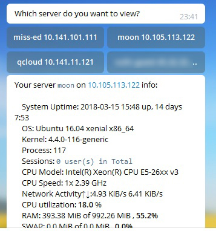
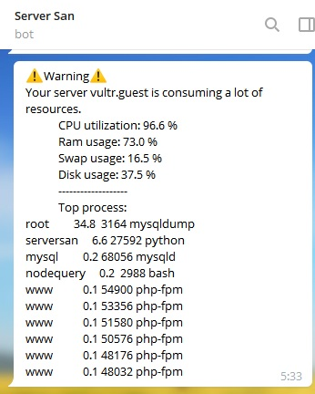

# ServerSan
This project is still under development. However, you may want to [try it out](https://t.me/serversan_bot)!

## Description ##
A telegram bot client/server to monitor Linux/Windows server status.
The reference is [nodequery](https://nodequery.com).

## Tutorial ##
ServerSan is now under testing. You could just click [this link](https://t.me/serversan_bot) to join her!
Any feedback would be deeply appreciated!

## Screenshot ##

## About stability ##
This program is still under actively early design, so before using it, I would like to make a disclaimer:
* Your data could be deleted without your consent.
* You may receive bot's message which was sent by mistake.
* Your server information(IP, CPU, Mem and so on) maybe reviewed by me if I need the database to run debugs.
* Any changes may not be informed.
In conclusion, a)Welcome to test her; b)No promises for now, though.

## Setup your own bot ##
Please reference [DEPLOY.MD](DEPLOY.MD).

## Development status ##
- [x] client side script is almost done. Except for upgrade utility.
- [x] Server side program
- [x] SSL support 
- [x] Delete unused server block within 30 minutes.
- [x] Warning when resource exceeds
- [x] Personal settings: notifications.
- [x] Auto clean old records: every 180 days, not enable for now 
- [ ] Generate plot about mem, CPU, Disk...
- [ ] TravisCI
- [ ] Windows client scripts maybe?

## For Developers and Contributors: Design Pattern ##
This program should support any platform that has a officially supported Python2/3.
This program could be split into four parts:

### 1. Client side ###
1. It's a tiny python script running periodically with cron and gathering system information.
After that, it's going to send POST request to the server.
2. The installation should be done by a shell script with an auth code generated when talking with serversan_bot.
3. Refer to nodequery, the auth code should be saved in `/etc/serversan/auth.log`

### 2. Server side: webhook ###
This webhook, is designed to receive and parse POST request from client side. 
In order to prevent from DDoS attack, replay attack or any other kind of attack, we should verify the request. 
After the validation of one single request, the webhook will parse and insert the information into database.

### 3. Server side: database ###
Currently we preferred to use MongoDB instead of MySQL. The database, serversan, for now contains three collections(tables):
1. user info table, the columns are: userID, username, nickname, role_id
2. system info table: cpu, mem, disk.....Key, token
3. role table: role_id, name, permission.

Be advised that every valid request will be stored in database for future demos(charts, etc.).

### 4. Server side: telebot ###
This part should handle interaction with telegram bot. Its command should contain at least the following functions:
stat, add, delete, start, help, reinstall, threshold settings(for heavy resource consumption)
The command may be extended in the future.

### Conclusion ###
The server needs two program: webhook and telebot.

## Packages ##
Flask for webhook, pyTelegramBotAPI for telegram bot wrapper, APScheduler for cron job inside telebot.
And MongoDB for database.

## Contribution ##
Any issues, PRs are welcomed! However, collaborators should obey some requirements:
1. Commits should be atomic, one commit should only resolve one issue. Thus please rebase your commits when necessary.
2. Use English in comments and readme. Follow PEP8.
3. Use tab, indent size of 4 spaces. By the way, shell scripts should be ended with LF.
4. Test before push.
5. Repository structure should follow common structures: 
test dir for unit test, serversan for main program, shell script and auxiliaries should be placed in root.
6. Security of the server side is extremely important and should be able to protect against normal attacks.

## FAQ ##
### Why don't you choose to use `nq-agent.sh` ###
Because shell scripts are limited to UNIX-like system while I want to add support for non-UNIX system if possible.

## License ##
Apache License 2.0